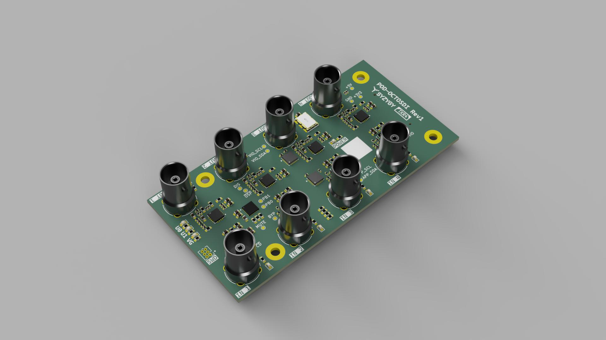

# syzygy-octosdi

SYZYGY™ TXR4 Compatible 3G-SDI Pod, with quad inputs and quad outputs.

Compatible with the SYZYGY Specification Version 1.1.1. The "SYZYGY™" mark is owned by Opal Kelly.

## Features
- SYZYGY TXR4 Pod
- 4x 3D-SDI inputs and 4x 3G-SDI outputs, all independent
- Full-size BNC connectors
- TI LMH0344 Cable Equalizers
- Semtech GS2988 Cable Drivers
- Lock/Signal Present LEDs at each BNC
- 148.5MHz oscillator on REFCLK
- I2C I/O expanders for all driver/equalizer control and status signals
- SmartVIO STM32G031 microcontroller with ability to measure VIO voltage

## Limitations
- Only 3G-SDI is supported
- There is no 148.5/1.001 MHz oscillator support
  - The board has only been designed for fractional framerates to keep the design a bit simpler. Depending on your FPGA, there may be enough tolerance on the MGT PLL to allow fractional rate inputs to be received despite it not being the correct frequency. This is the case at least for Xilinx Ultrascale+ GTYs with a +/-1250 ppm tolerance. However, this will not work for the transmitters which require the exact frequency.
- No reclockers on the board. It is designed to be plugged directly into an FPGA so this likely has no impact on its use.

## BOM Substitutions
While this board has been designed to use LMH0344 for the cable EQs and GS2988 for the cable drivers, there is broad compatibility across Semtech and TIs SDI portfolio. As such, some unpopulated footprints are available for passives needed for one chip or another, in particular for replacing the GS2988 with a LMH0302. See TI's SNLA280 for a full list of available substitutes for cable drivers, and SNLA283 for cable equalizers.

## [Interactive BOM](https://html-preview.github.io/?url=https://github.com/calebfletcher/syzygy-octosdi/blob/main/docs/ibom.html)

## Ordering Details
Designed to meet JLCPCBs standard capabilities.

Four layers, 1.6 mm, 1 oz outer/0.5 oz inner, JLC04161H-7628 stackup, controlled impedance.

## SYZYGY Compatibility Table

Following the pod compatibility table in [Appendix A of the SYZYGY Specification Version 1.1.1](https://syzygyfpga.io/wp-content/uploads/2023/09/Syzygy-Specification-V1p1p1.pdf):

| Parameter | syzygy-octosdi |
|-----------|----------------|
| Type | SYZYGY Transceiver (TXR-4) |
| Maximum 5V supply current | 0 mA |
| Maximum 3.3V supply current | 1.2 A (provisional design budget) |
| VIO supply voltage(s) | 1.8 V, 2.5 V, or 3.3 V |
| Maximum VIO supply current | 10 mA (provisional design budget) |
| Total number of I/O | 4 single-ended (S0–S3) |
| Number of differential I/O pairs (Standard pod only) | N/A (TXR-4 pod) |
| Transceiver lanes | 4 RX and 4 TX, plus REFCLK input |
| Width | Single |

The current budgets are conservative estimates from the schematic and component specifications; they have not been verified by measurement. The 5V pin is routed only to a test point. VIO powers the I/O side of the two expanders and the control-signal pull-ups.

## SYZYGY Pinout
Pinout for CN1 (QTH-020-01-F-D-DP-A):

| Pin number | Pin name      | Pin net      |
|------------|---------------|--------------|
| 01         | SCL\_01       | VIO\_I2C.SCL |
| 02         | +5V\_02       | +5V          |
| 03         | SDA\_03       | VIO\_I2C.SDA |
| 04         | R\_GA\_04     | R\_GA        |
| 05         | RX0P\_05      | RX0.P        |
| 06         | TX0P\_06      | TX0.P        |
| 07         | RX0N\_07      | RX0.N        |
| 08         | TX0N\_08      | TX0.N        |
| 09         | RX1P\_09      | RX1.P        |
| 10         | TX1P\_10      | TX1.P        |
| 11         | RX1N\_11      | RX1.N        |
| 12         | TX1N\_12      | TX1.N        |
| 13         | REFCLKP\_13   | REFCLK.P     |
| 14         | S0\_14        | I2C.SCL      |
| 15         | REFCLKN\_15   | REFCLK.N     |
| 16         | S1\_16        | I2C.SDA      |
| 17         | S2\_17        | ~{RESET}     |
| 18         | S3\_18        | ~{INT}       |
| 19         | S4\_19        | NC           |
| 20         | S5\_20        | NC           |
| 21         | S6\_21        | NC           |
| 22         | S7\_22        | NC           |
| 23         | S8\_23        | NC           |
| 24         | S9\_24        | NC           |
| 25         | RX3P\_25      | RX3.P        |
| 26         | TX3P\_26      | TX3.P        |
| 27         | RX3N\_27      | RX3.N        |
| 28         | TX3N\_28      | TX3.N        |
| 29         | RX2P\_29      | RX2.P        |
| 30         | TX2P\_30      | TX2.P        |
| 31         | RX2N\_31      | RX2.N        |
| 32         | TX2N\_32      | TX2.N        |
| 33         | P2C\_CLKP\_33 | NC           |
| 34         | C2P\_CLKP\_34 | NC           |
| 35         | P2C\_CLKN\_35 | NC           |
| 36         | C2P\_CLKN\_36 | NC           |
| 37         | RSVD\_37      | NC           |
| 38         | RSVD\_38      | NC           |
| 39         | VIO1\_39      | VIO          |
| 40         | +3.3V\_40     | +3V3         |
| G1         | GND\_G1       | GND          |
| G2         | GND\_G2       | GND          |
| G3         | GND\_G3       | GND          |
| G4         | GND\_G4       | GND          |

## SmartVIO STM32 Pinout
Pinout for U11 (STM32G031G8Ux):

| Pin number | Pin name       | Pin net               |
|------------|----------------|-----------------------|
| 1          | PC14\_1        | NC                    |
| 2          | PC15\_2        | NC                    |
| 3          | VDD\_3         | +3V3                  |
| 4          | VSS\_4         | GND                   |
| 5          | PF2\_5         | SmartVIO/NRST         |
| 6          | ADC1\_IN0\_6   | R\_GA                 |
| 7          | ADC1\_IN1\_7   | VIO                   |
| 8          | PA2\_8         | VIO\_GOOD             |
| 9          | PA3\_9         | ~{VIO\_GOOD}          |
| 10         | PA4\_10        | NC                    |
| 11         | PA5\_11        | NC                    |
| 12         | PA6\_12        | NC                    |
| 13         | PA7\_13        | NC                    |
| 14         | PB0\_14        | Net-(U11-PB0)         |
| 15         | PB1\_15        | Net-(U11-PB1)         |
| 16         | PA8\_16        | NC                    |
| 17         | PC6\_17        | NC                    |
| 18         | PA9/PA11\_18   | NC                    |
| 19         | PA10/PA12\_19  | NC                    |
| 20         | SYS\_SWDIO\_20 | SmartVIO/SWDIO        |
| 21         | SYS\_SWCLK\_21 | SmartVIO/SWCLK        |
| 22         | PA15\_22       | NC                    |
| 23         | PB3\_23        | NC                    |
| 24         | PB4\_24        | SmartVIO/USER\_LED\_0 |
| 25         | PB5\_25        | SmartVIO/USER\_LED\_1 |
| 26         | I2C1\_SCL\_26  | VIO\_I2C.SCL          |
| 27         | I2C1\_SDA\_27  | VIO\_I2C.SDA          |
| 28         | PB8\_28        | NC                    |
